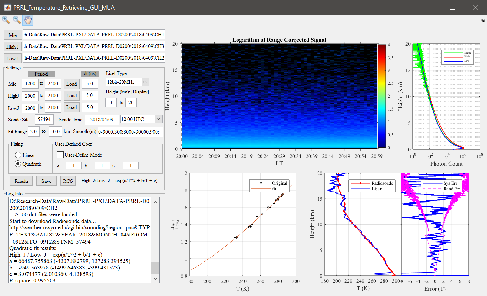
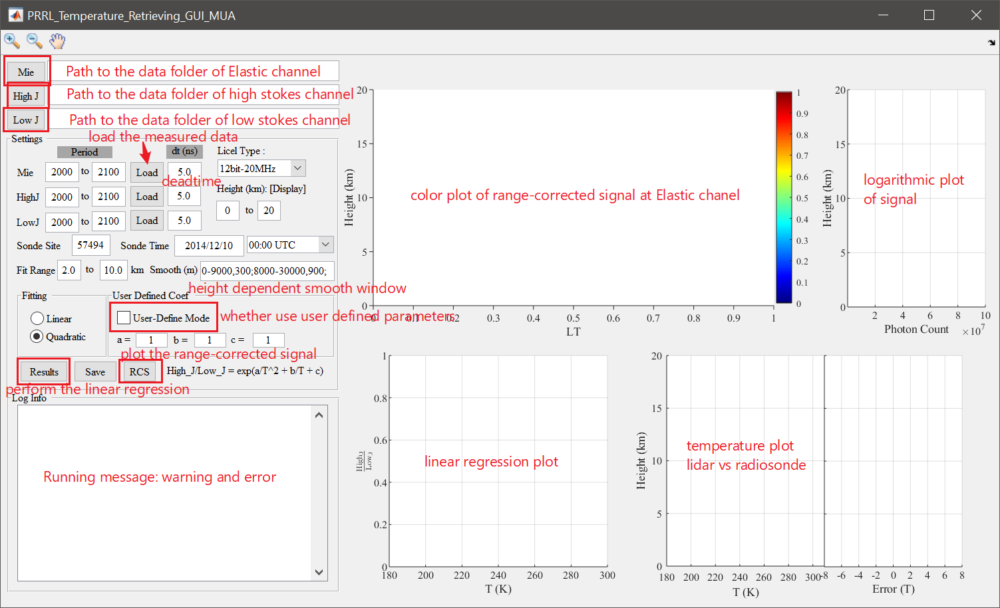

## Rotational Raman Lidar for Temperature Retrieving (GUI)
[](https://github.com/ZPYin/MUA_RRL_DA/graphs/commit-activity)

### Requirements

- MATLAB (>= 2014a)
- Network connection for downloading the radiosonde data

### Download

```
git clone https://github.com/ZPYin/MUA_RRL_DA.git
```

### Installation/running

This repository only contains the [MATLAB][1] scripts, which can be directly executed by MATLAB interpreter. Therefore, you don't need to compile the code if you have MATLAB installed in your machine.

Running the MATLAB code is rather simple. Go to the MATLAB command line, and type the code below

``` matlab
cd {project_dir_of_RRL_GUI}   % change your work directory to the folder of RRL_GUI
PRRL_Temperature_Retrieving_GUI_MUA   % running the code to popup the GUI
```

Or you can drag the file of `PRRL_Temperature_Retrieving_RRL_GUI` to the MATLAB command line, it will then be executed.


If you don't have any experience with MATLAB, you can go to the link below to find more information.
> https://de.mathworks.com/help/matlab/matlab_prog/run-sections-of-programs.html

### Features



1. Lidar signal visualization
2. Some basic signal pre-processing, including background substraction, deadtime correction and range correction
3. Linear and polynomia fit to enable temperature retrieving
4. Output of the temperature profile and regression results for future analysis.

### Usage



1. Setup the folder of the Mie (Elastic channel), High/Low J channels (Only support the data format of MUA lidar)
2. Select the temporal range of the data and then click `Load`, which will load the signal for each channel
3. Click `RCS` will show you the color plot of the signal to help you screen the cloud profiles
4. Select the radiosonde info, including the site number and radiosonde time, to guide the program to download the radioosnde data
5. Choose the regression type: `Linear` or `Quadratic`. You can also turn on the `User Define Mode` to allow you to input the regression parameters for the temperature retrieving. And adjust the smoothing window to build up the SNR
6. Click `Results` will show you the figures of the regression and the temperature comparisons with the radiosonde data
7. Output the temperature profile if you feel the agreement is acceptable


### Contact

If you need to know more or have any suggestions, please contact me.

Zhenping: ZP.Yin@whu.edu.cn

[1]:https://en.wikipedia.org/wiki/MATLAB